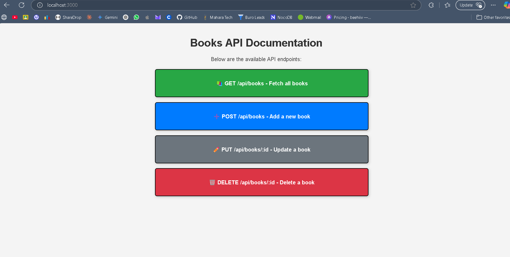

# Book Management API



This project is a RESTful API for managing a list of books using Express.js. The API implements the four main CRUD operations: Create, Read, Update, and Delete. For simplicity, the book data is stored in memory using a hardcoded array, eliminating the need for a database management system.

## Features

- Create a new book
- Retrieve a list of all books
- Update an existing book
- Delete a book by its ID

## API Endpoints

1. **Create a Book**
   - **POST** `/books`
   - Request Body: JSON object containing book details (title, author, etc.)

2. **Get All Books**
   - **GET** `/books`
   - Response: JSON array of all books 

3. **Update a Book**
   - **PUT** `/books/:id`
   - Request Body: JSON object containing updated book details
   - Response: JSON object of the updated book

4. **Delete a Book**
   - **DELETE** `/books/:id`
   - Response: Confirmation message upon successful deletion

## Getting Started

1. Clone the repository:
   ```bash
   git clone <repository-url>
